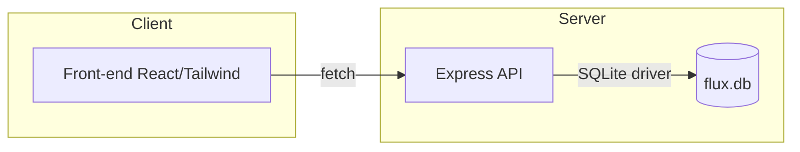
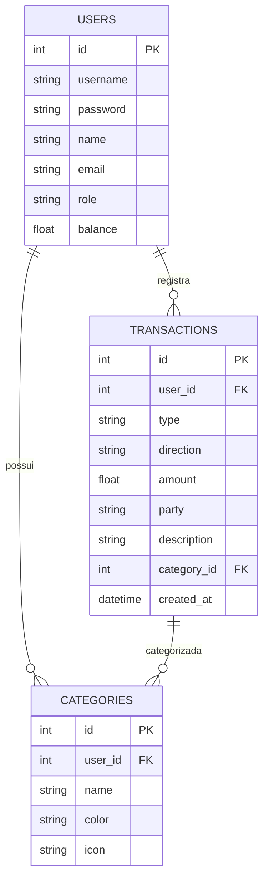

# Arquitetura Técnica — Flux

## Visão Geral

- **Front-end:** SPA em React (Vite), estilização com Tailwind CSS, gerenciamento de estado global via Zustand. Localização: `client/`.
- **Back-end:** API RESTful em Node.js (Express), persistência em SQLite. Localização: `server/`.
- **Banco de Dados:** SQLite local (`server/data/flux.db`), migrado e populado automaticamente.

## Execução Local

1. Instale as dependências:

- `cd server && npm install`
- `cd ../client && npm install`

2. Inicie o backend (porta 4000):

- `cd server && npm run start`

3. Em outro terminal, inicie o frontend (porta 5173):

- `cd client && npm run dev`

4. Acesse `http://localhost:5173`.
5. O banco SQLite será criado automaticamente em `server/data/flux.db`.

## Diagrama de Componentes

## Diagrama de Casos de Uso

## Modelo Entidade-Relacionamento (E-R)

## Extrato Inteligente — Funcionalidades

- **Filtros:**
  - Tipo de transação (`type`): PIX, Pagamento, Recarga, Compra, Seguro, Empréstimo.
  - Categoria (`category_id`): customizável por usuário.
  - Período (`created_at`): seleção de datas.
- **Gráficos:**
  - Distribuição de valores por categoria e tipo (Chart.js via react-chartjs-2).
  - Cores e ícones definidos por categoria.
- **Comprovantes:**
  - Geração automática para cada transação, com dados completos (ID, valor, tipo, data, conta, status).
  - Compartilhamento via Web Share API ou cópia para área de transferência.
- **Navegação:**
  - Abas para transações atuais e futuras (baseado em `created_at`).
  - Busca instantânea e responsiva.

## Camada de Personalização

- **Categorias customizáveis:**
  - CRUD completo de categorias (nome, cor, ícone) por usuário.
  - Integração direta com filtros, gráficos e comprovantes.
- **Engajamento:**
  - Incentivo à categorização para melhor visualização e controle financeiro.

## UI/UX — Detalhes Técnicos

- **Responsividade:**
  - Layout fluido (Tailwind) para web, tablet e mobile.
  - Componentes adaptativos e navegação mobile-first.
- **Acessibilidade:**
  - Contraste alto, fontes Inter, navegação por teclado e feedback visual.
- **Visual:**
  - Paleta clara, cor primária #ED1C24, gráficos animados, ícones SVG.
  - Botões e cards com espaçamento generoso e foco em usabilidade.

## Fluxo de Categorização (Regras de Negócio)

- PIX enviado → categoria **Transferência** (saída)
- Recarga → **Telefone** (saída)
- Pagamento → **Contas** (saída)
- Compra com cashback → **Compras** (saída)
- Seguro contratado → **Seguros** (saída)
- Empréstimo contratado → **Empréstimos** (entrada)

## Endpoints REST — API

- `POST /api/auth/login` — autenticação de usuário
- `POST /api/pix/send` — envio de PIX
- `POST /api/payments` — pagamento de contas
- `POST /api/recharges` — recarga de celular
- `POST /api/services/purchase` — compras com cashback
- `POST /api/services/insurance` — contratação de seguro
- `POST /api/services/loan` — contratação de empréstimo
- `GET /api/transactions` — listagem de transações
- `GET /api/summary` — resumo financeiro
- `GET /api/users/:id` — dados do usuário
- `PUT /api/users/:id` — atualização de perfil

## Convenções Visuais

- Cor primária: vermelho `#ED1C24`
- Fundo claro, alto contraste
- Botões arredondados
- Tipografia Inter
