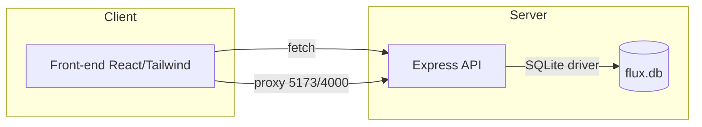
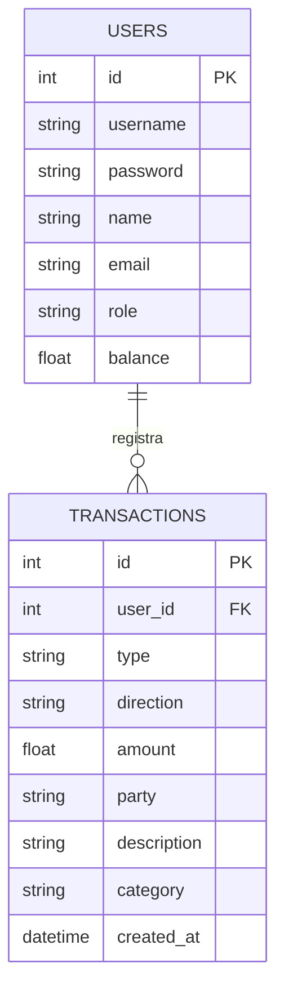

# Arquitetura Flux

## Visão geral
- **Front-end**: React (Vite) com Tailwind e Zustand para estado global. Comunicação com `/api` via fetch.
- **Back-end**: Node.js + Express. Rotas REST para PIX, pagamentos, recargas, serviços, perfil e login simulado.
- **Banco**: SQLite local em `data/flux.db` com tabelas `users` e `transactions` (com `user_id`).

## Diagrama de componentes (Mermaid)


## Diagrama UML de casos de uso
```mermaid
usecaseDiagram
  actor Usuario
  rectangle Flux {
    usecase EnviarPIX as "Enviar PIX"
    usecase PagarConta as "Pagar conta"
    usecase Recarregar as "Recarga"
    usecase ConsultarExtrato as "Extrato inteligente"
    usecase GerenciarPerfil as "Perfil e logout"
  }
  Usuario --> EnviarPIX
  Usuario --> PagarConta
  Usuario --> Recarregar
  Usuario --> ConsultarExtrato
  Usuario --> GerenciarPerfil
```

## Modelo E-R simplificado


## Fluxo de categorização
- PIX enviado → categoria **Transferência** (saída)
- PIX recebido → **Recebimento** (entrada)
- Recarga → **Telefone** (saída)
- Pagamento → **Contas** (saída)

## Rotas principais
- `POST /api/auth/login`
- `POST /api/pix/send`
- `POST /api/payments`
- `POST /api/recharges`
- `POST /api/services/purchase`
- `POST /api/services/insurance`
- `POST /api/services/loan`
- `GET /api/transactions`
- `GET /api/summary`
- `GET /api/users/:id`
- `PUT /api/users/:id`

## Convenções visuais
- Primária: vermelho Claro `#ED1C24`.
- Fundo claro, alto contraste, botões arredondados e tipografia Inter.
