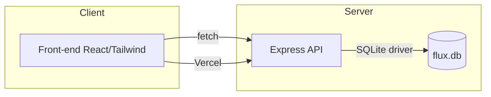
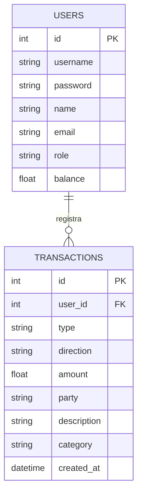

# Arquitetura Flux

## Visão geral

- **Front-end:** React (Vite) + Tailwind + Zustand. Deploy recomendado: Vercel (diretório `client/`).
- **Back-end:** Node.js + Express + SQLite. Deploy recomendado: Render, Railway ou outra plataforma Node (diretório `server/`).
- **Banco:** SQLite local (`server/data/flux.db`).

## Deploy em nuvem

- **Frontend:**
  - Suba o projeto para o GitHub.
  - No Vercel, selecione o repositório e a pasta `client/`.
  - Configure o build (`npm run build`) e output (`dist`).
  - Configure a variável de ambiente `VITE_API_URL` apontando para a URL do backend hospedado.
- **Backend:**
  - Suba a pasta `server/` em Render, Railway ou similar.
  - Configure o start (`npm run start`) e mantenha o banco SQLite persistente.
  - Exporte a URL do backend (ex: `https://flux-backend.onrender.com`).

## Diagrama de componentes (Mermaid)



## Diagrama UML de casos de uso

```mermaid
usecaseDiagram
  actor Usuario
  rectangle Flux {
    usecase EnviarPIX as "Enviar PIX"
    usecase PagarConta as "Pagar conta"
    usecase Recarregar as "Recarga"
    usecase ConsultarExtrato as "Extrato inteligente"
    usecase GerenciarPerfil as "Perfil e logout"
  }
  Usuario --> EnviarPIX
  Usuario --> PagarConta
  Usuario --> Recarregar
  Usuario --> ConsultarExtrato
  Usuario --> GerenciarPerfil
```

## Modelo E-R simplificado



## Fluxo de categorização

- PIX enviado → categoria **Transferência** (saída)
- PIX recebido → **Recebimento** (entrada)
- Recarga → **Telefone** (saída)
- Pagamento → **Contas** (saída)

## Rotas principais

- `POST /api/auth/login`
- `POST /api/pix/send`
- `POST /api/payments`
- `POST /api/recharges`
- `POST /api/services/purchase`
- `POST /api/services/insurance`
- `POST /api/services/loan`
- `GET /api/transactions`
- `GET /api/summary`
- `GET /api/users/:id`
- `PUT /api/users/:id`

## Convenções visuais

- Primária: vermelho Claro `#ED1C24`.
- Fundo claro, alto contraste, botões arredondados e tipografia Inter.
