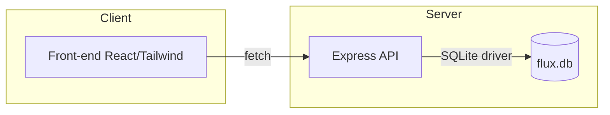
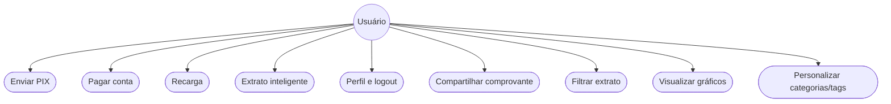
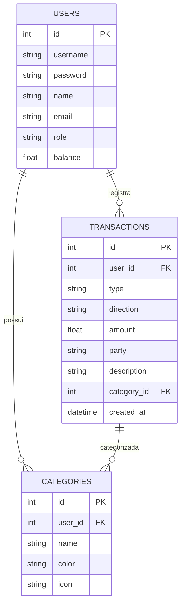

# Arquitetura Flux

## Visão geral

- **Front-end:** React (Vite) + Tailwind + Zustand. Deploy recomendado: Vercel (diretório `client/`).
- **Back-end:** Node.js + Express + SQLite. Deploy recomendado: Render, Railway ou outra plataforma Node (diretório `server/`).
- **Banco:** SQLite local (`server/data/flux.db`).

## Como rodar localmente

1. Instale as dependências em cada pasta:

- `cd server && npm install`
- `cd ../client && npm install`

2. Inicie o backend:

- `cd server && npm run start` (porta 4000)

3. Em outro terminal, inicie o frontend:

- `cd client && npm run dev` (porta 5173, proxy para a API)

4. Acesse `http://localhost:5173` no navegador.
5. O banco SQLite será criado automaticamente em `server/data/flux.db`.

## Diagrama de componentes (Mermaid)

## Diagrama de casos de uso (compatível GitHub)

## Modelo E-R simplificado

## Extrato Inteligente

O Extrato Inteligente do Flux oferece:

- **Filtros avançados:** por tipo de transação, categoria e período.
- **Gráficos dinâmicos:** distribuição de gastos por categoria e tipo, com cores e ícones personalizados.
- **Comprovantes digitais:** cada transação gera comprovante detalhado, com opção de compartilhamento nativo (Web Share API) ou cópia para área de transferência.
- **Busca e navegação responsiva:** resultados instantâneos, abas para transações atuais e futuras.

## Camada de Personalização

- **Categorias customizáveis:** usuário pode criar, editar e excluir categorias, escolhendo cor e ícone.
- **Engajamento:** a personalização estimula o usuário a categorizar suas transações, tornando o extrato mais visual, útil e interativo.
- **Integração com filtros e gráficos:** toda personalização é refletida nos filtros, gráficos e comprovantes, promovendo senso de controle e pertencimento.

## UI/UX

- **Design responsivo:** interface adaptada para web, tablet e celular, com grid fluido e componentes reativos.
- **Acessibilidade:** contraste alto, fontes legíveis (Inter), botões grandes e feedback visual em todas as ações.
- **Visual atrativo:** paleta clara, destaque para cor primária (#ED1C24), gráficos animados, ícones modernos e navegação intuitiva.
- **Experiência mobile-first:** menus, cards e botões otimizados para toque, sem perder recursos avançados no desktop.

## Fluxo de categorização

- PIX enviado → categoria **Transferência** (saída)
- Recarga → **Telefone** (saída)
- Pagamento → **Contas** (saída)
- Compra com cashback → **Compras** (saída)
- Seguro contratado → **Seguros** (saída)
- Empréstimo contratado → **Empréstimos** (entrada)

## Rotas principais

- `POST /api/auth/login`
- `POST /api/pix/send`
- `POST /api/payments`
- `POST /api/recharges`
- `POST /api/services/purchase`
- `POST /api/services/insurance`
- `POST /api/services/loan`
- `GET /api/transactions`
- `GET /api/summary`
- `GET /api/users/:id`
- `PUT /api/users/:id`

## Convenções visuais

- Primária: vermelho `#ED1C24`.
- Fundo claro, alto contraste, botões arredondados e tipografia Inter.
